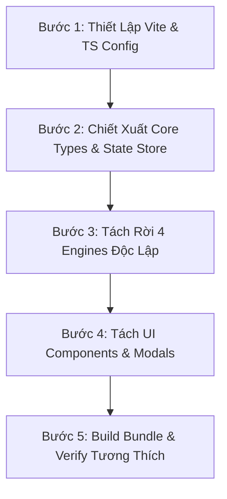

# Code Architecture Modernizer Skill
*Quy chuẩn & Kỹ thuật hiện đại hóa kiến trúc mã nguồn cho Trấn Quốc Phò Mã Gia*

---

## 1. TỔNG QUAN KIẾN TRÚC & MỤC TIÊU

Dự án ban đầu phát triển trên mô hình **Zero-bundler Standalone Static** (`prototype/app.js` ~3.855 dòng code nguyên khối). Mô hình này giúp kiểm chứng nhanh (Rapid Prototyping) và mở file HTML chạy ngay không cần web server, nhưng khi mở rộng quy mô sang hàng chục danh tướng, hệ thống đa chiến dịch và hàng trăm nghìn dòng thoại Ink, nó gặp các rào cản nghiêm trọng:
1. **Namespace Collision & Khó bảo trì**: Mọi biến toàn cục, UI handler và logic gameplay đan xen trong một closure duy nhất.
2. **Không có Type Safety**: Dễ phát sinh lỗi runtime khi truy cập sai cấu trúc thuộc tính `Hero`, `Card`, `BattleEncounter`.
3. **Thiếu Unit Testability**: Không thể cô lập từng engine (Combat, Gacha, VN, Map) để viết unit tests độc lập.
4. **Không có HMR (Hot Module Replacement)**: Mỗi lần sửa CSS hay logic phải F5 tải lại toàn bộ tài nguyên.

### Mục Tiêu Kiến Trúc Mục Tiêu (Target Architecture)

```
tran-quoc-pho-ma-gia/
├── src/                               # Toàn bộ mã nguồn TypeScript/ES6 module hóa
│   ├── core/                          # State Store, EventBus, Config Loader, Types
│   ├── engines/                       # 4 Game Engines độc lập
│   │   ├── narrative/                 # InkEngine, Typewriter, Dual-Actor, Branching
│   │   ├── strategy/                  # Sa Bàn Sơn Hà, Node Graph, AP, Logistics
│   │   ├── combat/                    # Sa Trường 3 Làn, Intent, Wall, Turn Loop
│   │   └── gacha/                     # Bái Tướng Thần Đàn, Pity, 50/50, 3D Flip
│   ├── ui/                            # View Controllers & Diegetic Components
│   │   ├── hud/                       # Censer Nghi Kỵ, Faction Plate, Top Nav
│   │   ├── modals/                    # Hero Inspector, Milestones, Choices Modal
│   │   └── common/                    # Toast, Tooltips, Particle Canvas
│   ├── audio/                         # Web Audio Controller, Music, SFX
│   └── main.ts                        # Entry point khởi tạo và bootstrap
├── prototype/                         # Bản tĩnh phân phối và fallback legacy
└── vite.config.ts                     # Cấu hình Vite bundler & legacy output
```

---

## 2. NGUYÊN TẮC THIẾT KẾ BẤT BIẾN (INVIOLABLE RULES)

1. **Song Hành Hai Chế Độ (Dual-Target Support)**:
   - Chế độ 1: `npm run dev` khởi chạy Vite dev server với TypeScript và HMR siêu tốc.
   - Chế độ 2: `npm run build` xuất ra file bundle tương thích chạy tĩnh trực tiếp qua `file:///` hoặc server tĩnh mà không phụ thuộc backend.
2. **Tuân Thủ AGENTS.md**:
   - Mọi class, UI component phải tuân thủ chuẩn Typography 4 tầng tiếng Việt (`--font-title`, `--font-text`, `--font-serif`, `--font-seal`).
   - Giữ nguyên triết lý màu 60-30-10 (Obsidian #080a0d, Chu Sa #991b1b, Kim Kế #fbbf24).
   - Inactive views bắt buộc có `visibility: hidden !important; pointer-events: none !important;`.
3. **Zero Breaking Changes**:
   - Quá trình tách module phải bảo toàn 100% dữ liệu từ `GAME_DATA` và logic mutual gating giữa 3 tầng.

---

## 3. DANH MỤC CÁC MODULE CẦN TÁCH TỪ APP.JS

Chi tiết ánh xạ từ `prototype/app.js` (3.855 dòng) sang các module mới:

| Module Mục Tiêu | Trách Nhiệm | Nguồn gốc trong `app.js` |
|:---|:---|:---|
| `src/core/GameState.ts` | Quản lý Master State, Faction Progression, Unlocks, Resources | Lines 104-189 (`const state = {...}`) |
| `src/core/EventBus.ts` | Hệ thống sự kiện Pub/Sub liên lạc giữa các engine | Cơ chế callback rời rạc trong `app.js` |
| `src/engines/narrative/InkParser.ts` | Trình biên dịch & máy trạng thái Ink | `prototype/ink_engine.js` |
| `src/engines/narrative/NarrativeView.ts`| Điều khiển sân khấu VN, thoại 2 bên, typewriter | Lines 450-890 |
| `src/engines/strategy/MapEngine.ts` | Sa bàn đồ thị node mạng, điều phối lộ quân, tính AP | Lines 1200-1650 |
| `src/engines/combat/CombatEngine.ts` | Máy trạng thái chiến đấu 3 làn, Tường Thành 500HP, Boss Intent | Lines 1800-2650 |
| `src/engines/gacha/GachaAltar.ts` | Thần đài bái tướng, Pity 74-90, 50/50, Grand Reveal | Lines 2700-3300 |
| `src/ui/modals/HeroInspector.ts` | Bảng tra cứu 28 danh tướng, Tứ Duy radar, kỹ năng, duyên | Lines 3350-3700 |
| `src/ui/hud/SuspicionCenser.ts` | Lư trầm nghi kỵ Vũ Hoàng (0-100%) và hiệu ứng khói | Lines 3720-3855 |

---

## 4. QUY TRÌNH MIGRATION THEO 5 BƯỚC AN TOÀN



### Bước 1: Thiết Lập Vite & TypeScript
Cài đặt `vite`, `@vitejs/plugin-legacy`, `typescript`, `vitest` trong `package.json`. Xem cấu hình chi tiết tại [vite_config_template.md](file:///c:/Users/Admin/Documents/antigravity/tran-quoc-pho-ma-gia/.agents/skills/code-architecture-modernizer/references/vite_config_template.md).

### Bước 2: Chiết Xuất State Store & EventBus
Tạo `GameStateStore` với cơ chế subscribe listener. Mỗi khi State thay đổi (ví dụ: `ticketCount`, `suspicion`, `ownedHeroIds`), chỉ các component liên quan mới re-render, triệt tiêu việc gọi hàm cập nhật DOM phân tán.

### Bước 3: Đóng Gói 4 Engine Độc Lập
Mỗi engine là một Class độc lập tuân thủ interface:
```typescript
export interface IGameEngine {
  init(store: GameStateStore, bus: EventBus): void;
  destroy(): void;
  onStateUpdate(state: MasterGameState): void;
}
```

### Bước 4: Tách UI Components
Chuyển đổi toàn bộ DOM manipulation rời rạc trong `app.js` thành các UI class kế thừa `BaseComponent` với lifecycle rõ ràng: `mount()`, `bindEvents()`, `render()`, `unmount()`.

### Bước 5: Build Bundle & Regression Validation
Chạy script kiểm tra để đảm bảo bundle sinh ra chạy mượt mà trên browser, không có lỗi console, không vỡ layout font chữ.

---

## 5. TÀI LIỆU & FILE MẪU KÈM THEO
- Chi tiết ánh xạ từng hàm: [module_map.md](file:///c:/Users/Admin/Documents/antigravity/tran-quoc-pho-ma-gia/.agents/skills/code-architecture-modernizer/references/module_map.md)
- Template cấu hình Vite: [vite_config_template.md](file:///c:/Users/Admin/Documents/antigravity/tran-quoc-pho-ma-gia/.agents/skills/code-architecture-modernizer/references/vite_config_template.md)
- Checklist kiểm thử di chuyển: [migration_checklist.md](file:///c:/Users/Admin/Documents/antigravity/tran-quoc-pho-ma-gia/.agents/skills/code-architecture-modernizer/references/migration_checklist.md)
