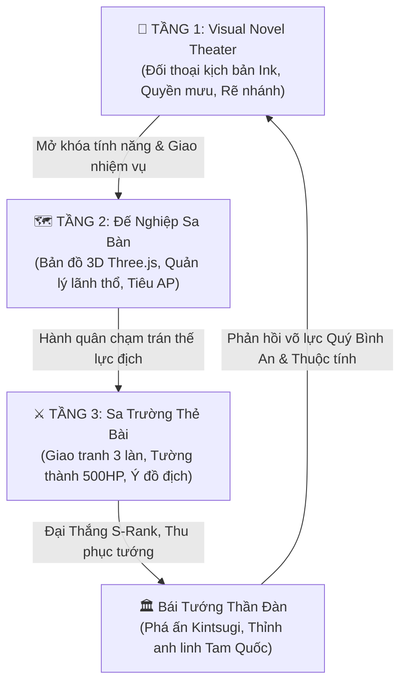

# 📜 Trấn Quốc Phò Mã Gia (镇国驸马爷)
### Grand Strategy Campaign, Tactical Card Battler & Branching Visual Novel Engine

> **Chuyển thể từ nguyên tác**: Tiểu thuyết mạng lịch sử / quân sự / quyền mưu *Trấn Quốc Phò Mã Gia* của tác giả Hiên Chí (轩轾)  
> **Quy mô nguyên tác**: 1.509 chương · 2.470.000 từ · 100% tiếng Việt  
> **Định hướng gameplay**: Chiến lược sa bàn mô phỏng lịch sử (Grand Strategy Campaign) kết hợp thẻ bài sa trường chiến thuật (Tactical Card Battler) & Visual Novel đa nhánh (Branching Narrative)  
> **Phạm vi Season 1**: Từ Chương 1 (*Phò Mã hàn vi nơm nớp lo sợ*) đến Chương 386 (*Đăng cơ Hoàng đế lập ra Đại Hán, ban bố Bốn Đại Chính Lệnh*)  
> **Tiêu chuẩn nghệ thuật**: Tả Thực Cổ Phong Thủy Mặc & Kim Kế Hắc Ám (Eastern Grimdark Realism + Ink Wash Aesthetics + Kintsugi Molten Gold)

---

## 🌟 ĐIỂM NỔI BẬT CỦA DỰ ÁN

### 1. 📜 Bám Sát 100% Cốt Truyện Nguyên Tác Canon (1.509 Chương)
- **Chuẩn hóa Timeline Lịch Sử Tuyệt Đối**:
  - **Chương 1 – 14**: *Phò Mã Phủ Hàn Vi* — Giải vế đối Nam Ly tại Kim Loan Điện, thức tỉnh Thiên Cơ Hệ Thống (Ch.5), giải độc mật thất, phát minh xà phòng Thấu Hoa Cao (Ch.8).
  - **Chương 17 – 21**: *Vạn Kim Mưu Sĩ Mã Tắc (Ấu Thường)* — Tích đủ 10.000 kim triệu hoán Mã Tắc. Nhận thấy tật "chỉ thượng đàm binh", Quý Bình An lập kế **"Cao Nâng Mã Tắc"**: dâng biểu xin Vũ Hoàng ban Miễn Tử Lệnh cho Mã Tắc, rồi tiến cử sang làm quân sư cho đối thủ Tô Vân khiến phe Tô Vân sa lầy; đồng thời giao Mã Tắc củng cố thành phòng Liễu Châu.
  - **Chương 27 – 30**: *Độc Sĩ Giả Hủ & Huyết Y Doanh* — Hố 20 vạn kim từ Vũ Hoàng, triệu hoán Giả Hủ; chiêu mộ toàn bộ tử tù lập nên **Huyết Y Doanh** (đội quân cảm tử áo máu).
  - **Chương 48 – 52**: *Đại Chiến Thanh Châu* — Triệu Vân dẫn Huyết Y Doanh hiệp đồng Giả Hủ phá đê xả lũ sông Thanh Thủy, dìm chết quân Nam Ly.
  - **Chương 63**: Triệu hoán Cổ Chi Ác Lai **Điển Vi** bảo vệ soái trướng.
  - **Chương 200**: Triệu hoán **Cao Thuận** & xây dựng thiết giáp bộ binh **Hãm Trận Doanh** (Hồi 4: *Trấn Quốc Khởi Vân*).
  - **Chương 201 – 386**: Triệu hoán Tuân Úc (Ch.201), phong Trấn Quốc Công (Ch.255), thăng Tịnh Kiên Vương (Ch.303), Tam Nhượng Đế Vị & Đăng cơ Hoàng Đế Đại Hán (Ch.386).

### 2. 🛡️ Quy Chuẩn Canon Bất Khả Xâm Phạm (Inviolable Canon Rules)
- **100% Nghi Thức Bái Tướng Thần Đàn (Mandatory Summoning Ritual)**:
  - Mọi tướng triệu hoán (Triệu Vân, Mã Tắc, Giả Hủ, Điển Vi, Cao Thuận...) bắt buộc kích hoạt toàn diện nghi thức cổ phong: Bát Quái phá ấn, rạn nứt Kintsugi hoàng kim, sấm chớp giáng lâm, Splash Art toàn màn hình, Bảng chỉ số Tứ Duy, Danh xưng võ học và Ấn triện chu sa.
- **Không Dùng Chung Tài Nguyên (Zero Asset Sharing)**:
  - 100% nhân vật xuất hiện trong kịch bản Visual Novel (kể cả Vũ Hoàng, Tô Kiến Phong, Sứ Thần Nam Ly, Vệ Ti Vũ, Tỳ Nữ, Thích Khách...) đều sở hữu Standee PNG/WebP độc bản bóc nền trong suốt RGBA.
- **Triệt Tiêu Hoàn Toàn Bệnh "Web Dashboard / SaaS / E-Commerce"**:
  - 🚫 Tuyệt đối cấm card thống kê hình chữ nhật kiểu KPI/Google Analytics.
  - 🚫 Tuyệt đối cấm hàng nút bấm mua hàng kiểu giỏ hàng Shopify (`.upgrade-tray`).
  - 🚫 Tuyệt đối cấm tab lọc dẹt văn phòng và thanh cuộn xám native của trình duyệt.
  - ✅ **100% Thành Phần Nhập Vai Diegetic Cổ Phong**:
    - **Thư Trục Xuyến Chỉ (Silk Parchment)**: Mở bảng tra cứu dưới dạng Trục Cuộn Phong Thần Bảng hai đầu nẹp gỗ mun bịt đồng.
    - **Bổn Mệnh Thư Giản (Bamboo Slips)**: Duyệt danh sách tướng bằng hàng thẻ tre khắc tên và ấn triện phân loại (`[ 武 ]`, `[ 謀 ]`, `[ 巾 ]`, `[ 異 ]`).
    - **Ngũ Trọng Trận Đồ Khắc Minh**: Nâng cấp tướng qua 5 vòng pháp trận Bát Quái & Cửu Đỉnh Luyện Khí bằng thao tác ấn triện chu sa và khớp nối phù tiết thay cho nút mua hàng.
    - **Chữ Hán Đại Tả & Ấn Triện Chu Sa**: Số thứ tự chương và tài nguyên thể hiện qua chữ Hán cổ (`壹`, `伍`, `拾`, `贰拾`, `佰`...) và ấn triện (`[ 駙 ]`, `[ 策 ]`, `[ 血 ]`, `[ 壇 ]`, `[ 戈 ]`, `[ 卷 ]`).

### 3. 🎨 Hệ Thống Nghệ Thuật & Âm Thanh Diegetic
- **Kiến Trúc Typography 4 Lớp Tiếng Việt An Toàn**:
  - `--font-title`: *Playfair Display*, *Cormorant Garamond*, *Noto Serif* (Tiêu đề, địa danh, sát thương).
  - `--font-text`: *Be Vietnam Pro* (Giao diện, nhãn số, thông số).
  - `--font-serif`: *Lora*, *Noto Serif* (Lời thoại văn học Visual Novel).
  - `--font-seal`: *ZCOOL XiaoWei*, *Noto Serif SC* (Ấn triện khắc chu sa cổ phong).
- **Âm Thanh Tổng Hợp Web Audio API**:
  - Nhạc nền Ambient thủ tục thích ứng theo phân cảnh (phòng kín, đại điện, sa trường).
  - Hiệu ứng âm thanh diegetic: tiếng mộc bản lật mở, bút lông quét mực, tiếng đóng triện chu sa đanh gọn, tiếng sấm sét phá ấn Bát Quái.

---

## 🏗️ KIẾN TRÚC MÃ NGUỒN HIỆN ĐẠI (ES6 MODULES & TYPESCRIPT)

Dự án đã được hiện đại hóa toàn diện từ mã nguồn nguyên khối sang kiến trúc module hướng đối tượng, tách bạch rõ ràng giữa State, Engine, UI và Audio:

```
tran-quoc-pho-ma-gia/
├── src/                               # Toàn bộ mã nguồn TypeScript hiện đại
│   ├── main.ts                        # Điểm khởi động ứng dụng
│   ├── bridge.ts                      # Cầu nối tương thích giữa mã nguồn cũ và hệ thống module mới
│   ├── core/                          # Quản lý Trạng Thái & Logic Tiến Trình
│   │   ├── DataLoader.ts              # Nạp dữ liệu cấu hình game & kịch bản Ink
│   │   ├── EventBus.ts                # Bus sự kiện trung tâm (Decoupled pub/sub)
│   │   ├── GameCoordinator.ts         # Điều phối luồng chuyển đổi giữa 3 tầng chơi
│   │   ├── GameStateStore.ts          # Store trạng thái tập trung phản ứng nhanh
│   │   ├── ProgressionEngine.ts       # Quản lý 5 tầng thế lực & mở khóa tính năng
│   │   ├── canonHeroesData.ts         # Database 29 danh tướng Canon 1.509 chương
│   │   └── types.ts                   # Định nghĩa kiểu dữ liệu chuẩn TypeScript
│   ├── engines/                       # Bộ Ba Động Cơ Trò Chơi
│   │   ├── narrative/                 # TẦNG 1: Visual Novel Theater & Pixi sương mù
│   │   │   ├── InkEngine.ts           # Trình thông dịch kịch bản Ink phân nhánh
│   │   │   ├── VisualNovelEngine.ts   # Điều khiển sân khấu, thoại kép & Standee
│   │   │   └── PixiMistAtmosphere.ts  # Hiệu ứng khí quyển sương mù thủy mặc
│   │   ├── strategy/                  # TẦNG 2: Sa Bàn 3D Three.js
│   │   │   └── ThreeWarTable.ts       # Bàn cát chiến lược 3D mô phỏng địa hình
│   │   ├── combat/                    # TẦNG 3: Sa Trường Thẻ Bài 3 Làn
│   │   │   ├── TacticalBattleEngine.ts # Logic giao tranh thẻ bài & Tường thành
│   │   │   └── PhaserCombatFx.ts      # Hiệu ứng chém kích, hỏa tiễn, lôi đòn Phaser
│   │   └── gacha/                     # Hệ Thống Triệu Hoán Bái Tướng Thần Đàn
│   │       ├── GachaEngine.ts         # Nghi thức phá ấn Kintsugi & Splash Art
│   │       └── PityCalculator.ts      # Tính toán xác suất & cơ chế bảo hiểm Pity
│   ├── ui/                            # Giao Diện Cổ Phong Diegetic
│   │   ├── ViewportScaler.ts          # Co giãn chuẩn tỷ lệ 16:9 responsive không méo
│   │   ├── hud/DiegeticHud.ts         # Khung tài nguyên ngọc ấn & điểm AP sa bàn
│   │   └── modals/                    # Bảng Tra Cứu Cổ Phong
│   │       ├── ModalsManager.ts       # Quản lý cửa sổ mở cuộn & phím tắt Escape
│   │       ├── BambooSlips.ts         # Thẻ tre duyệt danh tướng
│   │       └── HeroInspectorScroll.ts # Thư trục xuyến chỉ & Ngũ Trọng Trận Đồ
│   ├── audio/                         # Động Cơ Âm Thanh Web Audio
│   │   ├── AudioSynthesizer.ts        # Bộ tổng hợp âm thanh thủ tục (SFX)
│   │   └── ProceduralAmbientBgm.ts    # Nhạc nền ambient thích ứng
│   └── styles/                        # Hệ thống CSS module cổ phong không CSS-in-JS
│       ├── base.css, hud.css, modals.css, diegetic-modals.css...
├── data/                              # Dữ liệu kịch bản & cấu hình game
│   ├── game_config/                   # Cấu hình JSON (heroes, cards, milestones...)
│   ├── scenes/                        # Kịch bản phân nhánh Ink (ch01-15, ch16-52)
│   ├── game_bible_v2/                 # Master Game Bible bóc tách từ 1.509 chương
│   └── character_graph_v2/            # Đồ thị quan hệ 120 nhân vật tương tác PyVis
├── prototype/                         # Bản chạy thử nghiệm độc lập & tài nguyên đồ họa
│   ├── assets/images/                 # Toàn bộ Standee PNG/WebP độc bản & Bối cảnh
│   └── game_data.js                   # Bundle dữ liệu offline cho client
├── scripts/                           # Bộ công cụ tự động hóa, kiểm thử & build
│   ├── bundle_game_data.py            # Đóng gói dữ liệu cấu hình sang JS bundle
│   ├── narrative_validator.py         # Kiểm thử tự động kịch bản Ink (Pathfinding QA)
│   ├── sync-dist-assets.js            # Đồng bộ tài nguyên sang dist/ khi build
│   └── game_balance/                  # Kiểm tra cân bằng & toàn vẹn dữ liệu
├── dist/                              # Bản build production tối ưu hóa
├── vite.config.ts                     # Cấu hình Vite bundler
├── tsconfig.json                      # Cấu hình TypeScript nghiêm ngặt
└── package.json
```

---

## 🚀 HƯỚNG DẪN CÀI ĐẶT & CHẠY ỨNG DỤNG

### 1. Yêu Cầu Môi Trường
- **Node.js**: Phiên bản 18+ trở lên.
- **Python**: Phiên bản 3.9+ (để chạy các script bóc tách và đóng gói dữ liệu).

### 2. Cài Đặt Gói Phụ Thuộc
```bash
# Cài đặt dependencies (Vite, TypeScript, Pixi, Three, Phaser...)
npm install
```

### 3. Chạy Môi Trường Phát Triển (Development Server)
```bash
# Khởi chạy Vite dev server với Hot Module Replacement (HMR)
npm run dev
# Mở trình duyệt truy cập: http://localhost:5173/
```

### 4. Đóng Gói Bản Sản Phẩm (Production Build)
```bash
# Biên dịch TypeScript, đóng gói mã nguồn và đồng bộ assets vào thư mục dist/
npm run build

# Xem thử bản đóng gói production
npm run preview
```

### 5. Chạy Bộ Kiểm Thử Tự Động (Automated QA Suites)
```bash
# 1. Kiểm tra toàn vẹn kịch bản phân nhánh Ink (Narrative Pathfinding QA)
npm run test:narrative

# 2. Kiểm tra chéo toàn vẹn dữ liệu Game Config
python scripts/game_balance/validate_game_data.py

# 3. Kiểm tra 29 Danh Tướng Canon bám sát 1.509 chương
python scripts/game_balance/validate_canon_heroes.py

# 4. Đóng gói lại bundle dữ liệu game
python scripts/bundle_game_data.py
```

---

## 🎮 HỆ THỐNG GAMEPLAY "TAM ĐẠI TẦNG" (3-TIER GAMEPLAY)



1. **TẦNG 1 — Visual Novel Theater**:
   - Đối thơ triều đình, mật thất mưu sự, lựa chọn giữa lòng trung và dã tâm.
   - Quản lý **Thanh Nghi Kỵ Vũ Hoàng (0 - 100%)**: Cần khéo léo dùng xà phòng Thấu Hoa Cao và cống phẩm để giảm nghi kỵ, bảo toàn tính mạng trước khi đủ lông đủ cánh.
2. **TẦNG 2 — Đế Nghiệp Sa Bàn**:
   - Sa bàn 3D thể hiện địa thế hiểm trở: Đế Đô, 3 châu Bắc Cảnh, Hoài Hà, sông Thanh Thủy, quan ải Bắc Cô Sơn.
   - Quản lý Điểm Hành Động (AP), lương thảo, tuyển mộ binh lực và điều tra mật báo Hồng Nhan.
3. **TẦNG 3 — Sa Trường Thẻ Bài Chiến Thuật**:
   - Cơ chế giao chiến 3 làn (Tiền duyên, Trung quân, Hậu tập).
   - Thực thể **Tường Thành (Fortress Wall: 500 HP)** hưởng buff *Cao Lâm Hạ*.
   - Khắc chế binh chủng: Kỵ binh > Cung thủ > Bộ binh giáo dài > Kỵ binh.
   - Thẻ mưu lược đỉnh cao: *Thất Thám Bàn Xà* (Triệu Vân), *Đắp Đê Xả Lũ Hồng Thủy* (Giả Hủ), *Kỷ Luật Thiết Thạch* (Cao Thuận).

---

## 📜 KẾT QUẢ KIỂM ĐỊNH CHẤT LƯỢNG (QA METRICS)

| Hạng Mục Kiểm Tra | Công Cụ / Kịch Bản | Trạng Thái | Kết Quả Đạt Được |
| :--- | :--- | :---: | :--- |
| **Type Check** | `tsc --noEmit` | ✅ PASS | 0 lỗi TypeScript |
| **Kịch Bản Ink** | `narrative_validator.py` | ✅ PASS | 33 Knots, 31 Diverts, 0 Unresolved Diverts |
| **Dữ Liệu Tướng** | `validate_canon_heroes.py` | ✅ PASS | 29 Danh tướng khớp 100% 8 tầng cảnh giới |
| **Tính Cân Bằng** | `validate_game_data.py` | ✅ PASS | 17 thẻ bài, 3 chiến dịch, 18 mốc niên biểu |
| **Đóng Gói Static** | `npm run build` | ✅ PASS | Xuất dist/ hoàn chỉnh, zero broken links |

---

*Dự án được xây dựng với sự tôn trọng tuyệt đối dành cho nguyên tác văn học Trấn Quốc Phò Mã Gia, mang đến trải nghiệm nhập vai chiến thuật lịch sử cổ phong chuẩn mực nhất.*
