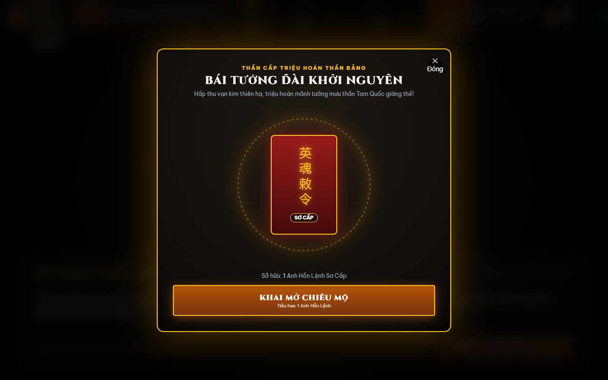
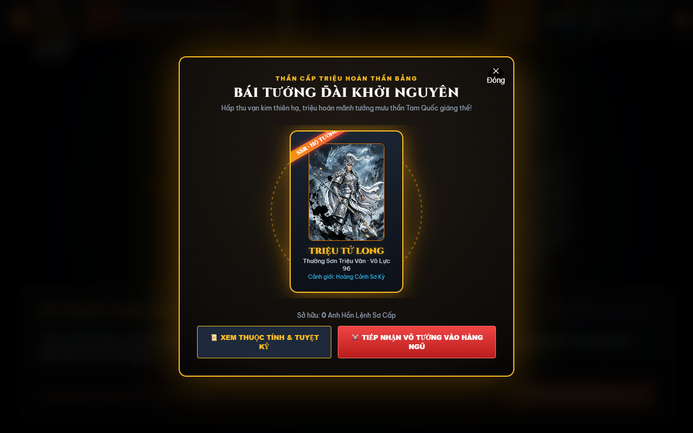
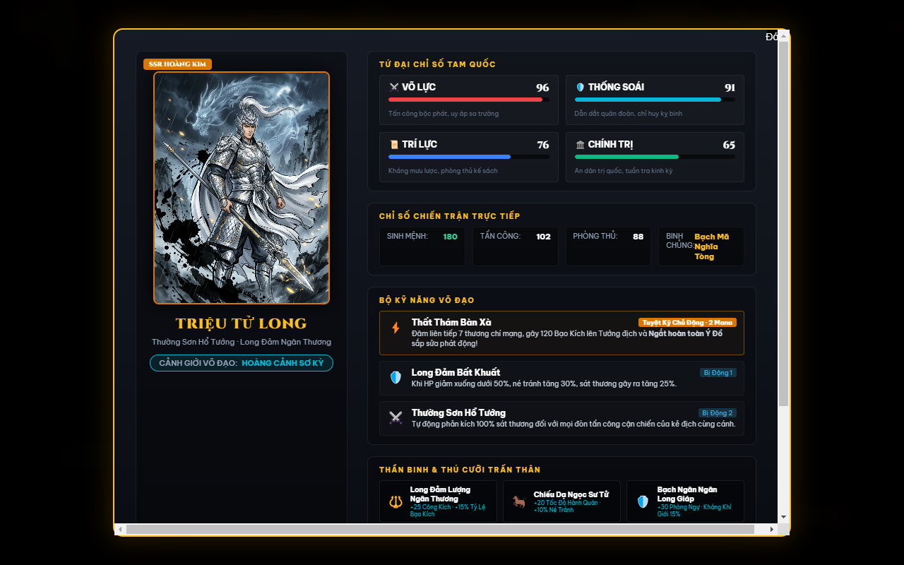
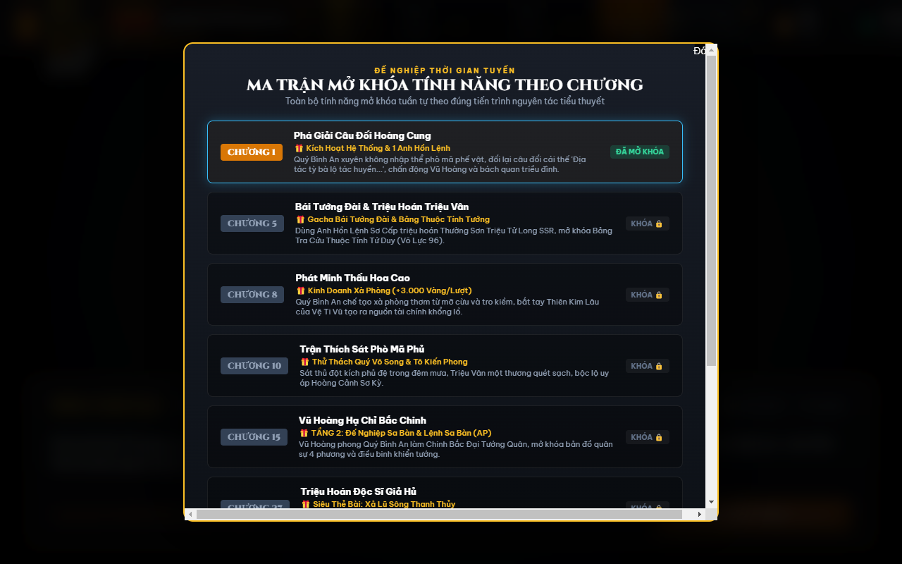
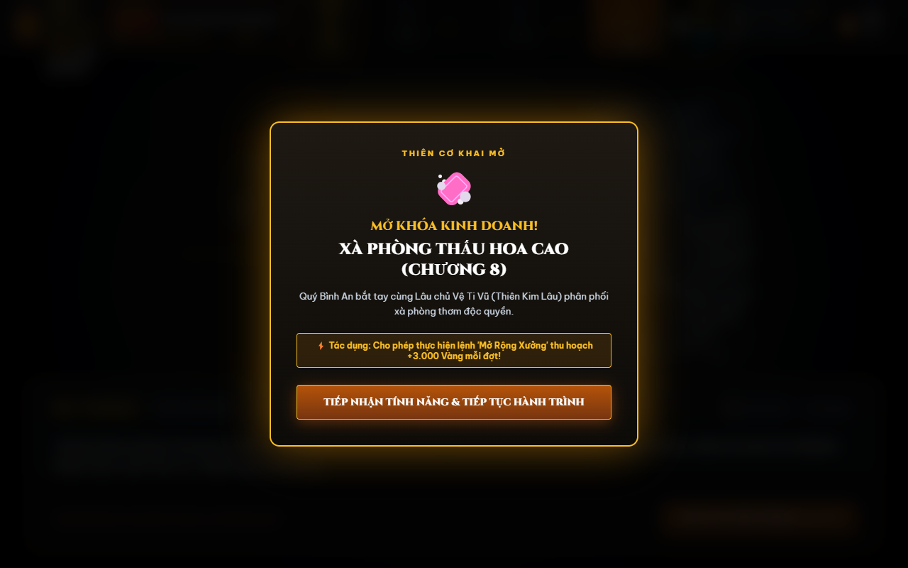

# 📜 Trấn Quốc Phò Mã Gia (鎮國駙馬爺)
### Grand Strategy Campaign & Tactical Card Battler Game Adaptation

> **Chuyển thể từ nguyên tác**: Tiểu thuyết mạng lịch sử / quân sự / huyền huyễn *Trấn Quốc Phò Mã Gia* của tác giả Hiên Chí (轩轾)  
> **Quy mô nguyên tác**: 1.509 chương · 2.470.000 từ · 100% tiếng Việt  
> **Định hướng gameplay**: Chiến lược sa bàn mô phỏng lịch sử (Grand Strategy Campaign) kết hợp thẻ bài sa trường chiến thuật (Tactical Card Battler) & Visual Novel đa nhánh (Branching Narrative)  
> **Phạm vi Season 1**: Từ Chương 1 (*Phò Mã hàn vi nơm nớp lo sợ*) đến Chương 386 (*Đăng cơ Hoàng đế lập ra Đại Hán, ban bố Bốn Đại Chính Lệnh*)

---

## 🌟 ĐIỂM NỔI BẬT CỦA DỰ ÁN

1. **Bộ Dữ Liệu Kịch Bản Toàn Diện (Game Bible V2)**:
   - Bóc tách sâu từ 1.509 chương truyện với **490 phần tử chuẩn hóa**:
     - 👥 **120 Nhân Vật** (Thuộc tính võ lực, cảnh giới võ đạo từ Vương Cảnh đến Nhân Tiên, vũ khí thần binh, thú cưỡi, tuyệt kỹ Tam Quốc chuẩn xác).
     - ⚔️ **68 Trận Đánh & Chiến Dịch Lớn** (Hỏa công Bắc Cô Sơn, Đại chiến Thanh Châu, Thủy chiến Hoài Hà, Hồn Huyết Sơn, Phi Mã Thành, Thiên Băng Địa Liệt...).
     - 📜 **116 Sự Kiện Cốt Truyện Trọng Điểm** (Tứ phương hội ngộ, Lấy nước đổi nước, Chân tướng Quý Vô Song, Bí mật Song Sinh Ngũ Thân của A Bố...).
     - 🏛️ **42 Tổ Chức & Lực Lượng** (Mạng lưới sát thủ Hồng Nhan, Cẩm Y Mật Thám, An Tức Vệ, Huyết Y Các, Thiên Cơ Lâu, Quốc Giáo Đại La...).
     - 🗺️ **63 Địa Danh Chiến Lược** (Đế Đô, Khai Nguyên, 3 châu Bắc Cảnh, Lâm Quan Thành, Ca Bỉ Hoàng Thành...).
     - 🔧 **37 Phát Minh & Công Nghệ** (Xà phòng Thấu Hoa Cao, Lưu Hỏa, Móng ngựa sắt, Cơ quan nỏ liên hoàn, Phẫu thuật mổ sọ Hoa Đà...).
     - ⚖️ **44 Biến Cố Chính Trị** (Bức cung phong vương, Bốn Đại Chính Lệnh, Tam nhượng đế vị...).

2. **Mô Hình Kiến Trúc "Tam Đại Tầng" (3-Tier Gameplay Architecture)**:
   - **TẦNG 1: Visual Novel Theater**: Dẫn dắt cốt truyện, tương tác nhân vật, lựa chọn quyền mưu với hệ thống đa kết cục (*True Ending, Bad Endings, What-If Endings*).
   - **TẦNG 2: Đế Nghiệp Sa Bàn (Grand Strategy Node Map)**: Quản lý bản đồ cứ điểm theo lượt (Turn-based Node Map), sử dụng điểm Hành Động (AP), điều phối quân lương, nâng cấp xưởng Thấu Hoa Cao và phái thám báo Hồng Nhan.
   - **TẦNG 3: Sa Trường Thẻ Bài (Tactical Card Battler)**: Giải quyết các chiến dịch công/thủ thành với thực thể **Tường Thành (Fortress Wall: 500 HP)** hưởng buff *Cao Lâm Hạ*, kết hợp độc kế Giả Hủ, dũng uy Triệu Vân và khí giới Mã Quân.

3. **Thanh Nghi Kỵ Của Vũ Hoàng (Emperor's Suspicion Meter: 0 - 100%)**:
   - Cơ chế độc nhất vô nhị phản ánh đúng bản chất chính trị của tác phẩm: Mọi hành động bành trướng quân sự đều đẩy mức nghi kỵ của hoàng đế lên cao. Người chơi phải dùng lợi nhuận từ *Thấu Hoa Cao* để đút lót và dâng nạp cống phẩm nhằm giữ chỉ số an toàn (< 60%) cho tới ngày Đăng Cơ Xưng Đế (Chương 386).

4. **Aesthetic Chủ Đạo: "Bạch Ngân Cổ Phong x Kim Kế Thủy Mặc" (Kintsugi Ink)**:
   - Giữ **100% nhận diện kinh điển** của từng anh linh Tam Quốc (Triệu Vân ngân giáp bạch bào, Quan Vũ lục bào thanh long đao...).
   - Điểm xuyết tinh tế **đường nứt dát vàng nóng chảy (Kintsugi Molten Gold)** tượng trưng cho *Anh Linh được đúc kết từ Vạn Kim của Quý Bình An*.
   - Khung nền hòa quyện giữa **thủy mặc đen (Sumi-e)**, tàn tro vàng và khói bụi chiến trường bi tráng.

---

## 🎮 BẢN MẪU WEB CHƠI THỬ (PLAYABLE WEB PROTOTYPE V2)

Dự án sở hữu một bản **Playable Web Prototype V2** được nâng cấp toàn diện với chiều sâu cơ chế thương mại, chạy độc lập không cần cài đặt môi trường:

```
prototype/
├── index.html                  # Giao diện chính 3 tầng + Bái Tướng Đài Gacha + Bảng Tướng + Ma Trận Tiến Trình
├── styles.css                  # Thiết kế Kintsugi Molten Gold x Obsidian Ink, 3D Card Flip & Bát Quái trận
├── app.js                      # Động cơ tương tác: Typewriter, Quản lý Mở khóa theo chương, Gacha, Sa Bàn, Sa Trường
└── assets/
    ├── images/zhaoyun.jpg      # Concept Art chuẩn duyệt: Triệu Tử Long (Bạch Ngân x Kim Kế)
    └── screenshots/            # Ảnh chụp trực tiếp gameplay
        ├── milestone_matrix.png     # Ma trận tiến trình mở khóa theo từng chương (Ch.1 - Ch.52)
        ├── gacha_altar.png          # Bái Tướng Đài chiêu mộ Anh Linh Tam Quốc (Bát Quái Kintsugi)
        ├── gacha_card_reveal.png    # Hiệu ứng lật thẻ 3D Card Flip & triệu hoán Triệu Vân SSR
        ├── hero_card_inspector.png  # Bảng soi chi tiết Tứ Duy, Cảnh giới, Thần Binh, Tuyệt Kỹ & Duyên Phận
        ├── feature_unlock_modal.png # Thánh chỉ thông báo mở khóa tính năng theo mốc chương
        ├── tier1_vn.png             # Tầng 1: Visual Novel Theater đối thơ đại điện & phân nhánh
        ├── tier2_map.png            # Tầng 2: Sa bàn địa lý 4 phương, thủy lộ Hoài Hà & phòng tuyến
        ├── tier3_battle.png         # Tầng 3: Đấu thẻ bài 3 làn, ý đồ kẻ địch (Enemy Intent) & Tường Thành
        └── tier3_victory.png        # Tầng 3: Màn hình quyết toán Đại Thắng S-Rank
```

### 📸 Gameplay Screenshots & Tính Năng Trọng Tâm:

#### 1. Bái Tướng Đài (Gacha Summoning Altar & 3D Card Reveal)
- **Chuẩn phong cách game thẻ bài Tam Quốc thương mại**: Tái hiện nghi thức chiêu mộ anh linh trang nghiêm với Trận pháp Bát Quái dát vàng Kintsugi xoay vần (`baguaRotate`), bùa chú chu sa và hào quang sấm sét giáng lâm.
- **Hiệu ứng lật mở thẻ bài 3D (3D Card Flip & Molten Gold Particles)**: Lật mở chân dung Thần Tướng Triệu Tử Long (SSR) uy phong lẫm liệt, kích hoạt hiệu ứng sương khói và ngân quang chấn động.
- **Tích hợp vào mạch truyện nguyên tác**: Mở khóa tại **Chương 5 (Phò Mã Phủ)** sau khi hoàn thành đối thơ và thức tỉnh Hệ Thống.




#### 2. Bảng Soi Thuộc Tính Danh Tướng (Hero Card Detail Inspector)
- **Hệ Thống Tứ Duy RPG Tam Quốc**:
  - ⚔️ **Võ Lực: 96/100** | 🛡️ **Thống Soái: 91/100** | 🧠 **Trí Lực: 76/100** | 📜 **Chính Trị: 65/100**
- **Cảnh Giới Võ Đạo & Chỉ Số Sinh Tồn**:
  - Cảnh giới: **Hoàng Cảnh Sơ Kỳ** (Bám sát thiết lập huyền huyễn nguyên tác).
  - Sinh lực: **180 HP** · Sát thương: **102 ATK** · Binh chủng: **Bạch Mã Nghĩa Tòng**.
- **Thần Binh & Thú Cưỡi Truyền Thuyết**:
  - Vũ khí: **Long Đảm Lượng Ngân Thương** (+25 Võ Lực, Đâm Xuyên Giáp).
  - Thú cưỡi: **Chiếu Dạ Ngọc Sư Tử** (+15 Thống Soái, Khởi Đầu Tăng Tốc).
- **Tuyệt Kỹ Sa Trường**:
  - *Thất Thám Bàn Xà* (Tuyệt kỹ chủ động: 120 ST, ngắt hoàn toàn đòn đánh của tướng địch).
  - *Long Đảm* (Bị động: Dưới 30% HP tăng 40% Né Tránh & Miễn Khống).
  - *Thường Sơn Hổ Tướng* (Bị động: Phản kích 50% sát thương khi bị tấn công cận chiến).
- **Hệ Thống Duyên Phận (Bonds Activation)**:
  - *Ngũ Hổ Thượng Tướng* (Cùng Quan Vũ, Trương Phi, Mã Siêu, Hoàng Trung): +25% Toàn Thuộc Tính.
  - *Thân Vệ Song Bích* (Cùng Điển Vi bảo vệ Quý Bình An): +20% Miễn Thương.
  - *Ngọa Long Phụ Tá* (Cùng Gia Cát Lượng): Khởi đầu trận đấu đầy 100% Nộ Khí.



#### 3. Ma Trận Mở Khóa Tính Năng Theo Từng Chương (Chapter Unlock Matrix)
Tuân thủ nguyên tắc thiết kế **Progressive Feature Unlock**: Người chơi không thể sử dụng bừa bãi mọi tính năng ngay từ đầu. Tất cả tính năng đều khóa chặt (🔒) và chỉ mở khóa khi người chơi đạt đúng mốc chương tương ứng trong cốt truyện:

| Chương Mốc | Tên Phân Cảnh Cốt Truyện | Tính Năng Được Khai Mở (Unlock) | Hiệu Quả Chiến Lược |
| :---: | :--- | :--- | :--- |
| **Chương 1** | Xuyên Không & Yến Tiệc Hoàng Cung | Thức Tỉnh Hệ Thống Anh Linh | Nhận 100 Vàng + 1 Anh Hồn Lệnh Sơ Cấp |
| **Chương 5** | Mật Thất Phò Mã Phủ | Mở khóa **Bái Tướng Đài Gacha** | Chiêu mộ Triệu Tử Long SSR & Mở Bảng Tướng |
| **Chương 8** | Thiên Kim Lâu & Lâu Chủ Vệ Ti Vũ | Mở khóa **Kinh Doanh Thấu Hoa Cao** | Sản xuất xà phòng tinh chế (+3.000 Vàng mỗi lượt) |
| **Chương 10** | Ám Sát Tại Sân Viện Phò Mã Phủ | Triệu Vân thi triển uy lực Hoàng Cảnh | Đập tan sát thủ, rẽ nhánh điều tra mật mưu |
| **Chương 15** | Vũ Hoàng Hạ Chỉ Chinh Phạt Bắc Cảnh | Mở khóa **Tầng 2: Đế Nghiệp Sa Bàn** | Bản đồ 4 vùng chiến lược, Thủy lộ Hoài Hà & Điểm AP |
| **Chương 27** | Hố Vàng Vũ Hoàng & Triệu Hoán Giả Hủ | Mở khóa **Siêu Thẻ Thủy Công Giả Hủ** | Kích hoạt Độc Kế Xả Lũ Sông Thanh Thủy |
| **Chương 43** | Bắt Sống Tri Huyện Lưu Nguyên | Mở khóa **Kho Lương Khai Nguyên** | Tiếp tế quân lương đại quân (+50.000 Thạch Lương) |
| **Chương 48-52** | Đại Quân Địch Hỏa Vây Thành Thanh Châu | Mở khóa **Tầng 3: Sa Trường Thẻ Bài** | Giao chiến thủ thành 3 làn, Tường thành 500 HP |




#### 4. Tầng 1: Visual Novel Theater (Đối Thoại Kép & Rẽ Nhánh Chuẩn Cốt Truyện)
- **Mở đầu bằng vế đối chấn động triều đình**: Sứ thần Nam Ly ngạo mạn ra vế đối *"Thiên đương kỳ bàn tinh tác tử, thùy nhân cảm hạ?"*, Quý Bình An đối lại vế câu thần sầu *"Địa tác tỳ bà lộ tác huyền, cái thế thùy đạn?"* chấn động văn võ bá quan.
- **Sân khấu hai nhân vật (Dual-Actor Stage)**: Quý Bình An / Triệu Vân đối đầu Tô Kiến Phong / Vũ Hoàng / Cổ Hủ với hiệu ứng rọi sáng chủ thể đang nói.
- **Phân nhánh kịch bản thực sự**: Lựa chọn chiến lược ảnh hưởng trực tiếp đến thanh *Nghi Kỵ Vũ Hoàng* và ngân khố.


#### 5. Tầng 2: Đế Nghiệp Sa Bàn (Bản Đồ Địa Lý 4 Vùng Chiến Lược)
- **Địa lý 4 phương rõ ràng**: Phân định trực quan 4 vùng lãnh thổ (Đại Vũ Hoàng Triều, Căn Cứ Bắc Cảnh, Nam Ly Xâm Lăng, Tây Lăng Thiết Kỵ).
- **Hệ thống sông ngòi & quan ải hiểm trở**: Thủy lộ Sông Hoài Hà, Sông Thanh Thủy và Dãy Núi Bắc Cô Sơn.
- **Bảng điều lệnh quân cơ**: Chi tiêu Điểm Hành Động (AP), Mở rộng xưởng xà phòng *Thấu Hoa Cao* (+3.000 Vàng), Cống nạp mua chuộc hoạn quan (-15% Nghi Kỵ).


#### 6. Tầng 3: Sa Trường Thẻ Bài Chiến Thuật (Enemy Intent & Tường Thành)
- **Cơ chế Ý Đồ Kẻ Địch (Enemy Intent System)**: Hiển thị minh bạch hành động sắp tới của quân Nam Ly mỗi hiệp (Công thành 80 HP, Bắn cung 35 HP, Bạo Liệt Đao Pháp của Địch Hỏa 90 HP).
- **Thực thể Tường Thành (Fortress Wall: 500 HP)**: Buff *Cao Lâm Hạ* che chắn hàng sau, hứng chịu sát thương từ Xe Đục Thành.
- **Độc Kế Giả Hủ — Trữ Lượng Nước Sông Thanh Thủy**: Tích lũy 3 cấp độ (Cấp 1: Đắp Đê -> Cấp 2: Nước Dâng -> Cấp 3: Đại Hồng Thủy), kích hoạt thẻ *Xả Lũ Thanh Thủy*.
- **Tuyệt Kỹ Thất Thám Bàn Xà của Triệu Vân**: Đâm liên hoàn 7 thương ngắt hoàn toàn ý đồ nguy hiểm của Tướng địch.
- **Đại Thắng S-Rank**: Màn hình vinh danh chiến tích với phần thưởng vàng, quân lương và mở khóa danh tướng tiếp theo (Điển Vi & Lý Nho).


### Cách trải nghiệm ngay:
* **Cách 1**: Nhấp đúp chuột mở trực tiếp tệp `prototype/index.html` trên bất kỳ trình duyệt nào (Chrome, Edge, Firefox, Brave).
* **Cách 2**: Chạy máy chủ tĩnh local:
  ```bash
  cd prototype
  python -m http.server 8080
  # Truy cập http://localhost:8080 trên trình duyệt
  ```

---

## 🕸️ ĐỒ THỊ QUAN HỆ NHÂN VẬT TƯƠNG TÁC (CHARACTER GRAPH V2)

Dự án sở hữu mạng lưới quan hệ 120 nhân vật tương tác độc lập dựng bằng NetworkX & PyVis:
* **Địa chỉ truy cập**: Mở tệp `data/character_graph_v2/index.html` trên trình duyệt.
* **Quy mô**: 120 Nodes, 356 Mối quan hệ đa chiều (Đồng minh, Kình địch, Quân thần, Gia tộc, Hôn nhân).
* **Tính năng**: Tìm kiếm nhân vật thời gian thực, bảng chú thích màu sắc 11 phe phái, click xem thẻ chi tiết thuộc tính từng nhân vật.

---

## 📁 CẤU TRÚC DỰ ÁN (PROJECT DIRECTORY)

```
tran-quoc-pho-ma-gia/
├── data/
│   ├── game_bible_v2/                 # Master Game Bible (490 elements)
│   │   ├── characters.json            # 120 nhân vật chuẩn hóa Tam Quốc
│   │   ├── battles.json               # 68 trận đánh lớn
│   │   ├── key_plot_events.json       # 116 sự kiện then chốt
│   │   ├── organizations.json         # 42 thế lực & tổ chức
│   │   ├── locations.json             # 63 địa danh chiến lược
│   │   ├── technologies.json          # 37 phát minh khoa kỹ
│   │   ├── political_events.json      # 44 biến cố chính trị
│   │   └── game_bible_v2_master.json  # Toàn bộ dữ liệu tổng hợp (463 KB)
│   ├── character_graph_v2/            # Đồ thị mạng lưới quan hệ nhân vật (HTML + JSON)
│   ├── chapter_feature_unlock_matrix.json # Ma trận mở khóa tính năng Ch.1-386 (Season 1)
│   ├── story_timeline.json            # Dòng thời gian 1.509 chương
│   └── tran_quoc_pho_ma_gia_full.json # Toàn văn 1.509 chương tiểu thuyết crawl
├── prototype/                         # Mã nguồn Bản Mẫu Web chơi thử nghiệm
│   ├── index.html
│   ├── styles.css
│   ├── app.js
│   └── assets/images/
├── scripts/                           # Bộ công cụ bóc tách, audit & xử lý dữ liệu
│   ├── crawler.py                     # Pipeline cào truyện bất đồng bộ
│   ├── deep_scan.py                   # Quét từ khóa toàn văn 1.509 chương
│   ├── merge_game_bible.py            # Hợp nhất và loại trùng Game Bible
│   ├── audit_and_fix_tam_quoc.py      # Chuẩn hóa danh xưng & thuật ngữ Tam Quốc
│   └── build_character_graph_v2.py    # Dựng đồ thị quan hệ PyVis
├── historical_strategy_game_design.md # Tài liệu thiết kế game chính thức (GDD)
└── README.md                          # Tài liệu giới thiệu dự án
```

---

## 🗺️ LỘ TRÌNH PHÁT TRIỂN (ROADMAP)

- [x] **Phase 1**: Thu thập & làm sạch dữ liệu toàn bộ 1.509 chương tiểu thuyết.
- [x] **Phase 2**: Trích xuất sâu kịch bản Game Bible V2 (490 elements, 120 nhân vật, 68 trận đánh).
- [x] **Phase 3**: Dựng đồ thị quan hệ tương tác PyVis & chuẩn hóa thuật ngữ Tam Quốc.
- [x] **Phase 4**: Xây dựng Game Design Document (GDD) theo chuẩn Grand Strategy Campaign Tam Đại Tầng.
- [x] **Phase 5**: Định hình Aesthetic "Kim Kế Thủy Mặc" & xây dựng Playable Web Prototype.
- [ ] **Phase 6**: Mở rộng toàn bộ 6 Acts của Season 1 lên Web Engine (Phaser 3 / PixiJS).
- [ ] **Phase 7**: Tích hợp hệ thống Lưu Trữ / Checkpoint & triển khai bản thử nghiệm cộng đồng.

---

*Dự án phát triển vì niềm đam mê với tác phẩm Trấn Quốc Phò Mã Gia và dòng game chiến thuật sa bàn lịch sử.*
