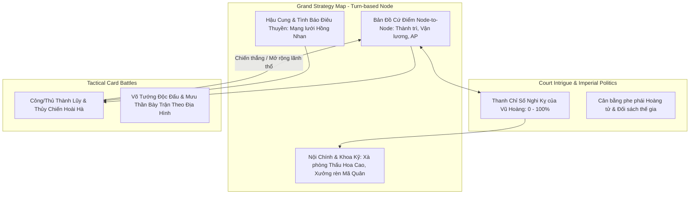
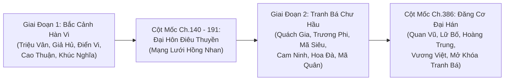
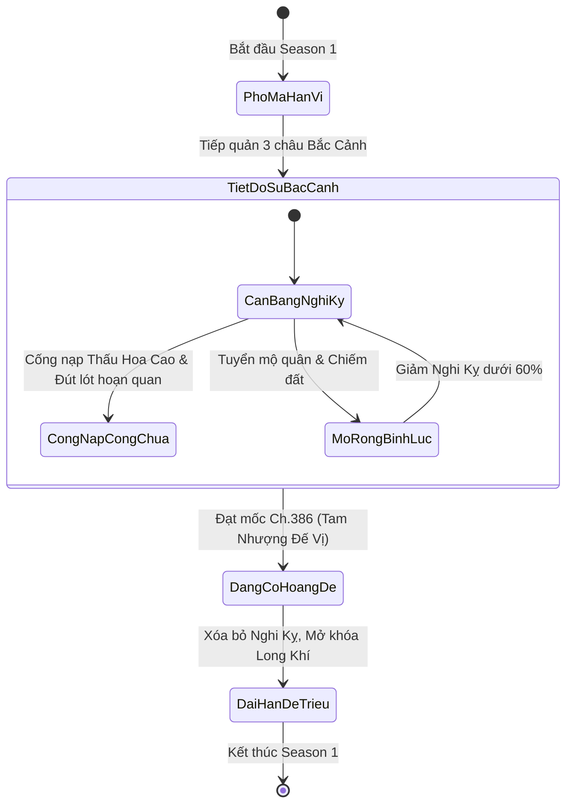

# 📜 TÀI LIỆU THIẾT KẾ GAME CHÍNH THỨC (GDD)
## DỰ ÁN: TRẤN QUỐC PHÒ MÃ GIA — KHỞI NGUYÊN ĐẾ NGHIỆP (SEASON 1)
> **Định hướng phát triển**: Chiến Lược Campaign Mô Phỏng Lịch Sử (Grand Strategy Campaign) kết hợp Thẻ Bài Sa Trường Chiến Thuật (Tactical Card Battler)  
> **Nguyên tác**: Tiểu thuyết *Trấn Quốc Phò Mã Gia* (Hiên Chí — 1.509 chương, 2.4 triệu từ)  
> **Phạm vi Season 1**: Từ Chương 1 (Phò mã hàn vi) đến Chương 386 (Đăng cơ Hoàng đế lập ra Đại Hán)  
> **Nền tảng kỹ thuật**: Web HTML5 (Phaser 3 / PixiJS) — Tối ưu hóa 60 FPS trên trình duyệt

---

## I. TỔNG QUAN ĐỊNH HƯỚNG & MÔ HÌNH TAM ĐẠI TẦNG

### 1. Triết Lý Thiết Kế: Grand Strategy Campaign
* Tác phẩm *Trấn Quốc Phò Mã Gia* sở hữu quy mô thế giới đồ sộ (120 nhân vật, 42 thế lực, 68 chiến dịch lớn, 63 thành trì). 
* Hành trình của **Quý Bình An** là một bản trường ca chuẩn mực của thể loại Grand Strategy: Từ một **Phò mã hàn vi nơm nớp lo sợ** $\rightarrow$ **Tiết độ sứ xây dựng căn cứ Bắc Cảnh** $\rightarrow$ **Chinh phạt chư hầu Tây Lăng, Nam Ly** $\rightarrow$ **Đăng cơ Hoàng đế lập ra Đại Hán**.
* Mô hình **Grand Strategy Campaign** (kết hợp tinh hoa giữa *Tam Quốc Chí / Total War* trên sa bàn và *Card Battler* trên sa trường) đem lại cảm giác xây dựng cơ đồ, trị quốc an dân và điều binh khiển tướng chân thực, hào hùng hơn rất nhiều so với các visual novel tuyến tính thông thường.

### 2. Mô hình Kiến trúc "Tam Đại Tầng" (3-Tier Gameplay Architecture)



### 3. Tối Ưu Hóa Nền Tảng Web: Kiến Trúc Bản Đồ Cứ Điểm Theo Lượt (Turn-based Node Map)
Để đảm bảo chạy siêu mượt 60 FPS trên trình duyệt Web (HTML5/Phaser) mà vẫn giữ trọn chiều sâu chiến lược:
* **Hệ thống Lượt Lịch Sử (Turn-based Timeline)**: Mỗi hiệp (Turn) tương ứng 1 tháng trong thế giới game.
* **Điểm Hành Động (Action Points - AP)**: Mỗi tháng Quý Bình An có một lượng AP hữu hạn (khởi đầu 3 AP, tăng dần theo tước vị từ Phò Mã $\rightarrow$ Điển Nông Trung Lang Tướng $\rightarrow$ Trấn Quốc Công).
* **Các Lệnh Tiêu Hao AP Trên Sa Bàn**:
  * *Nội chính*: Mở rộng cơ sở sản xuất Thấu Hoa Cao, chiêu nạp dân binh, nghiên cứu vũ khí tại Thiên Cung Học Viện.
  * *Quân sự*: Điều động quân đoàn di chuyển giữa các Cứ Điểm (Node-to-Node Movement), thiết lập tuyến vận lương.
  * *Điệp báo*: Cài cắm thám báo Hồng Nhan vào thành địch.
* **Chi phí Hành quân & Khoảng cách**: Mỗi tuyến đường giữa 2 Node (VD: Liễu Châu ➔ Bắc Cô Sơn) có chỉ số ngày đường. Quân đội di chuyển sẽ tự động trừ tiêu hao Lương Thảo theo từng ngày hành trình.

---

## II. HỆ THỐNG ĐIÊU THUYỀN & MẠNG LƯỚI HỒNG NHAN (CONSORT & ESPIONAGE SYSTEM)

> **Khóa Cứng Điêu Thuyền Cho Season 1**: Bám sát 100% nguyên tác tiểu thuyết. Điêu Thuyền là Chánh thê độc tôn của Quý Bình An tại Season 1, người hạ sinh Đích trưởng tử Thái tử Quý Sơn Hà (Ch.427) và trực tiếp sáng lập, chỉ huy mạng lưới nữ điệp báo Hồng Nhan. Không thay thế bằng mỹ nhân khác để bảo toàn tính toàn vẹn và chiều sâu của cốt truyện.

```
┌────────────────────────────────────────────────────────────────────────┐
│                   HỆ THỐNG ĐIÊU THUYỀN & MẠNG LƯỚI HỒNG NHAN           │
├──────────────────────────────┬─────────────────────────────────────────┤
│    TẦNG SA BÀN & QUỐC GIA   │          TẦNG CHIẾN ĐẤU SA TRƯỜNG       │
│  - Mạng lưới Thám Báo Điệp Viện│  - Hào Quang Bế Nguyệt (Mị hoặc gián tiếp)│
│  - Phục Kích & Ám Sát Tiền Trận │  - Trống Trận Bắc Cô Sơn (Siêu buff thủ) │
│  - An Dân & Sinh Thái Tử      │  - Thẻ Tình Báo: Nội Ứng Khai Môn      │
└──────────────────────────────┴─────────────────────────────────────────┘
```

### 1. Cột Mốc Triệu Hoán & Thức Tỉnh (Chương 140 - 191)
* Tại Chương 140, khi Quý Bình An định hình căn cứ Bắc Cảnh, hệ thống ban thưởng Thẻ Anh Hồn Tuyệt Sắc Sử Thi triệu hoán **Điêu Thuyền**.
* Chương 191 đánh dấu sự kiện **Đại Hôn Điêu Thuyền**, chính thức mở khóa giao diện quản lý **Mạng Lưới Hồng Nhan** trên sa bàn đại lục.

### 2. Cơ Chế Điệp Báo Sa Bàn (Espionage Actions)
Người chơi tiêu hao Điểm Tình Báo của Hồng Nhan để thực thi các chiến dịch đặc biệt:
* **Cài Cắm Gian Tế (Infiltration):** Thâm nhập vào các cứ điểm hiểm yếu (Đế Đô, Uyển Châu, Tây Hoàng Thành).
* **Nội Ứng Khai Môn (Gate Sabotage):** Mở khóa thẻ bài chiến thuật đặc biệt trong trận công thành, cho phép mở toang cổng thành ngay hiệp 1 mà không cần phá tường.
* **Đầu Độc Nguồn Nước & Đốt Lương:** Kẻ địch bước vào trận đánh chịu vĩnh viễn trạng thái `[Trúng Độc]` (-10% HP mỗi lượt) hoặc `[Tuyệt Lương]` (-1 Nội lực mỗi lượt).
* **Ly Gián Tướng Địch:** Làm suy giảm lòng trung thành của tướng trấn thủ đối phương, mở ra cơ hội chiêu hàng ngay trên sa trường.

### 3. Trợ Uy Sa Trường: "Trống Trận Bắc Cô Sơn"
Trong các trận thủ thành sống còn hoặc khi Quý Bình An đích thân đốc chiến:
* **Hào Quang Bế Nguyệt (Passive Aura):** Đầu mỗi hiệp, khiến 1 tướng địch ngẫu nhiên rơi vào trạng thái *Dao Động* (đánh trượt hoặc giảm 30% sát thương).
* **Trống Trận Huyết Chiến (Ultimate Skill):** Kích hoạt tiếng trống trợ uy huyền thoại của Điêu Thuyền: Toàn quân đạt 100% Sĩ Khí, tăng +2 Giáp Trụ cho mọi đạo quân và ban trạng thái "Bất Khuất" (không thể bị tiêu diệt trong 1 hiệp) cho 1 danh tướng tiền tuyến.

### 4. An Dân Hậu Phương & Kế Thừa Đại Nghiệp
* Điêu Thuyền trực tiếp phụ trách phát chẩn lương thực cho dân tị nạn chiến tranh tại Bắc Cảnh $\rightarrow$ Tăng mạnh chỉ số **Dân Tâm (Public Order)** và tốc độ tăng trưởng đinh khẩu.
* Sự kiện lịch sử sinh hạ **Thái tử Quý Sơn Hà**: Khẳng định tính chính thống của vương triều, mở khóa các đạo luật cai trị cấp cao của triều đình Đại Hán.

---

## III. TIẾN TRÌNH TRIỆU HOÁN TƯỚNG CHUẨN NGUYÊN TÁC (CANONICAL HEROES)

> **Nguyên tắc**: Bám sát 100% danh sách và thứ tự triệu hoán trong tiểu thuyết. Mỗi danh tướng đi kèm một **Gói Thẻ Binh Đoàn Độc Bản (Hero Archetype Kit)** gồm 6 - 8 lá bài riêng biệt.



### Chi Tiết Gói Thẻ Binh Đoàn Độc Bản (Hero Archetype Kits)
* **Triệu Vân (Triệu Tử Long)**:
  * Thẻ Tướng Triệu Vân (Hoàng Cảnh $\rightarrow$ Đế Cảnh).
  * Binh chủng: *Bạch Mã Nghĩa Tòng* (Kỵ binh cơ động cao, miễn nhiễm phục kích).
  * Thần binh / Thú cưỡi: *Long Đảm Lượng Ngân Thương*, *Dạ Chiếu Ngọc Sư Tử*.
  * Kỹ năng thẻ bài: *Thất Thám Bàn Xà Thương*, *Đơn Kỵ Cứu Chúa*.
* **Giả Hủ (Giả Văn Hòa)**:
  * Thẻ Mưu Thần Giả Hủ (Trí lực 98+).
  * Kỹ năng độc môn: *Độc Kế Thảo Phạt*, *Thủy Hỏa Vây Thành* (kích hoạt bài Xả Lũ / Hỏa Công).
  * Bài nội tại: *Minh Triết Bảo Thân* (Không thể bị chọn làm mục tiêu của kỹ năng ám sát).
* **Điển Vi (Cổ Chi Ác Lai)**:
  * Thẻ Tướng Điển Vi (Võ lực cực hạn, hộ vệ vô song).
  * Binh chủng: *Hổ Bí Vệ Cận Chiến*.
  * Vũ khí: *Song Thiết Kích* (Tấn Thiết Song Kích nặng 80 cân — hiệu ứng Phá Giáp 50%).
  * Kỹ năng thẻ bài: *Bạo Liệt Nộ Kích*, *Tử Thủ Hộ Chủ*.
* **Cao Thuận**:
  * Binh chủng độc quyền: **Hãm Trận Doanh** (800 dũng sĩ khôi giáp tinh lương, "mỗi chiến tất khắc", công thành cực mạnh).
* **Khúc Nghĩa**:
  * Binh chủng độc quyền: **Tiên Đăng Tử Sĩ** (800 xạ thủ cự nỏ chuyên khắc chế và tiêu diệt kỵ binh địch).
* **Mã Siêu (Cẩm Mã Siêu)**:
  * Kỵ binh độc quyền: **Tây Lương Thiết Kỵ** (sức càn quét dũng mãnh nhất thảo nguyên).
  * Thú cưỡi: *Sa Lý Phi*, Vũ khí: *Hổ Đầu Trạm Kim Thương*.
* **Cam Ninh & Chu Du**:
  * Binh chủng: **Giang Đông Thủy Quân** & **Cẩm Phàm Quân**.
  * Vũ khí: *Cổ Đĩnh Kiếm*, *Thiết Tỏa*.
  * Thẻ chiến thuật: *Hỏa Thiêu Giang Hà*, *Khổ Nhục Kế*.

---

## IV. CƠ CHẾ TRIỀU ĐÌNH & QUYỀN MƯU: "THANH NGHI KỴ VŨ HOÀNG"

Cơ chế phản ánh chân thực áp lực sinh tồn chính trị của Quý Bình An trước Chương 386:



1. **Thanh Chỉ Số Nghi Kỵ (Emperor's Suspicion Meter: 0 - 100%)**:
   * Mọi hành động tuyển mộ quân quy mô lớn hoặc thu phục thành trì đều làm tăng chỉ số Nghi Kỵ của Vũ Hoàng.
   * Nếu chạm mốc 100%: Vũ Hoàng hạ chiếu chỉ khép tội tạo phản, phái Cấm Vệ và Chiến Hổ Quân triệt hạ phủ đệ $\rightarrow$ Kích hoạt Bad Ending.
   * **Chiến thuật sinh tồn quyền mưu**:
     * Trích 20% - 30% doanh thu bán xà phòng *Thấu Hoa Cao* dâng nạp quốc khố.
     * Đút lót thái giám nội đình và kết minh với Công chúa để xoa dịu hoàng đế, duy trì chỉ số Nghi Kỵ ở mức an toàn (< 60%).
2. **Cột Mốc "Đăng Cơ Xưng Đế" (Chương 386)**:
   * Sau khi hoàn tất lộ trình mưu lược "Tam nhượng đế vị" và vạn dân dâng biểu thỉnh nguyện.
   * **Biến chuyển toàn diện cơ chế cai trị**:
     * Xóa bỏ hoàn toàn thanh Nghi Kỵ của Vũ Hoàng.
     * Mở khóa **Hoàng Đạo Long Khí**: Quy đổi chiến công toàn quốc thành *Anh Linh Điểm*.
     * Kích hoạt thẻ bài uy quyền tối cao: `[Ngôn Xuất Pháp Tùy]`.

---

## V. SA TRƯỜNG THẺ BÀI: TƯỜNG THÀNH & CHIẾN TRƯỜNG ĐẶC THÙ

### 1. Cơ Chế Tường Thành & Khí Giới Công Thành (Siege Warfare Engine)
Khi trận đánh là một cuộc công/thủ thành (như tại Khai Nguyên, Uyển Châu, Tây Hoàng Thành):

```
┌────────────────────────────────────────────────────────────────────────┐
│                        CHIẾN TRƯỜNG CÔNG / THỦ THÀNH                   │
├────────────────────────────────────────────────────────────────────────┤
│  [PHE THỦ - TRÊN MẶT THÀNH]: Cung thủ, Đá lăn, Nồi dầu Lưu Hỏa         │
│  [BUFF CAO LÂM HẠ]: +30% Tầm bắn, Miễn nhiễm cận chiến bộ kỵ           │
├────────────────────────────────────────────────────────────────────────┤
│  ════════════════════════════════════════════════════════════════════  │
│  🏰 THỰC THỂ TƯỜNG THÀNH (HP: 500 | Giáp: 50)                          │
│     * Bị sát thương bởi: Máy Bắn Đá, Thang Mây, Bộc Phá Lưu Hỏa        │
│     * Vô hiệu hóa bởi: Thẻ [Nội Ứng Khai Môn] của Điêu Thuyền          │
│  ════════════════════════════════════════════════════════════════════  │
├────────────────────────────────────────────────────────────────────────┤
│  [PHE CÔNG - DƯỚI CHÂN THÀNH]: Hãm Trận Doanh, Kỵ binh, Khí giới phá thành│
└────────────────────────────────────────────────────────────────────────┘
```

* **Thực thể Tường Thành (Fortress Wall)**:
  * Là một thực thể môi trường án ngữ tiền tuyến của phe thủ, có thanh **Độ Bền (HP)** và **Giáp Trụ**.
  * Chừng nào tường thành chưa sụp đổ, toàn bộ tướng và lính phe thủ được hưởng buff *"Cao Lâm Hạ"* (+30% sát thương xạ kích, miễn nhiễm hoàn toàn sát thương từ bộ binh và kỵ binh cận chiến của phe công).
* **Khí Giới Công Thành của Mã Quân**:
  * Phe công bắt buộc phải triển khai thẻ khí giới: *Máy Bắn Đá*, *Xe Đục Thành*, *Thang Mây* hoặc *Bộc Phá Lưu Hỏa* để công phá Tường Thành.
* **Tương tác đỉnh cao với Điêu Thuyền**:
  * Nếu thám báo Hồng Nhan đã cài cắm thành công gian tế trong thành trước trận đánh, người chơi được rút sẵn thẻ bài `[Nội Ứng Khai Môn]`. Sử dụng thẻ này sẽ mở toang cổng thành ngay hiệp 1, xóa bỏ hoàn toàn Tường Thành mà không tốn công công phá!

### 2. Thủy Chiến Hoài Hà (Naval Battles)
* Diễn ra khi hai bên chạm trán trên tuyến đường sông Hoài Hà.
* Kỵ binh bị giảm 50% uy lực; các tướng thủy quân như **Cam Ninh** và các thẻ chiến thuyền (*Mông Đồng, Lâu Thuyền*) tăng 100% sát thương.
* Kích hoạt thẻ chiến thuật kinh điển: `[Hỏa Thiêu Xích Bích]`, `[Thuận Gió Phóng Hỏa]`, `[Thiết Tỏa Liên Hoàn]`.

### 3. Tập Kích Hậu Cần & Cắt Đường Lương (Logistics Warfare)
* Nếu người chơi điều kỵ binh tốc độ cao phục kích đoàn tải lương của địch trên sa bàn, bộ bài của quân địch khi vào trận sẽ dính vĩnh viễn trạng thái `[Tuyệt Lương]` (mất 10% máu mỗi hiệp và giảm điểm nội lực điều quân).

---

## VI. KẾ HOẠCH HÀNH ĐỘNG TRIỂN KHAI (NEXT ACTIONS)

1. ✅ **Hợp nhất hoàn toàn** bản thiết kế này làm tiêu chuẩn GDD chính thức của dự án.
2. 🔨 **Bắt đầu xây dựng Interactive Web Prototype (Bản mẫu web thử nghiệm)**:
   - Dựng giao diện Sa Bàn Cứ Điểm (Turn-based Node Map) với 3 châu Bắc Cảnh.
   - Hiển thị thanh Nghi Kỵ Vũ Hoàng và nguồn thu từ Thấu Hoa Cao.
   - Thử nghiệm 1 trận đấu thẻ bài công thành đầu tiên có thực thể Tường Thành + Triệu Vân + Hãm Trận Doanh + Kỹ năng Hồng Nhan của Điêu Thuyền!
